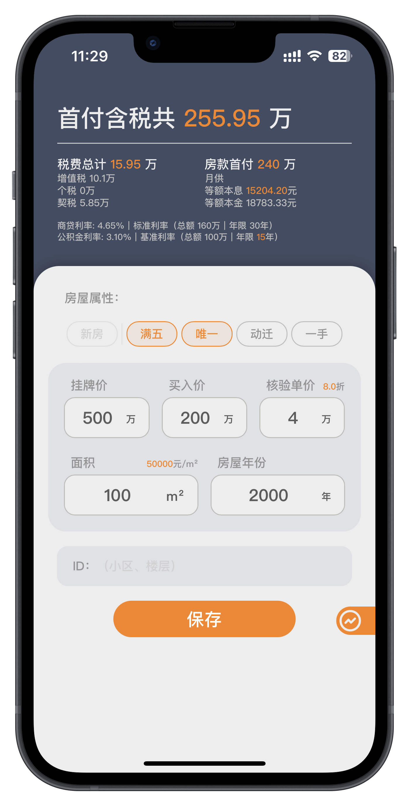
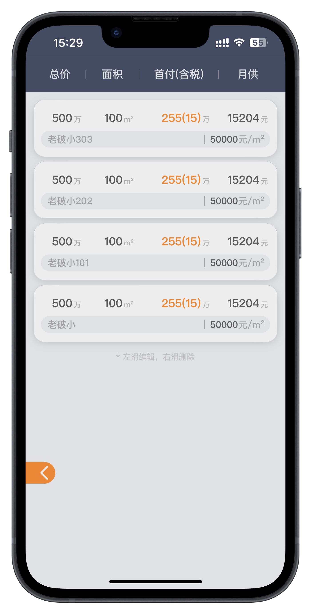
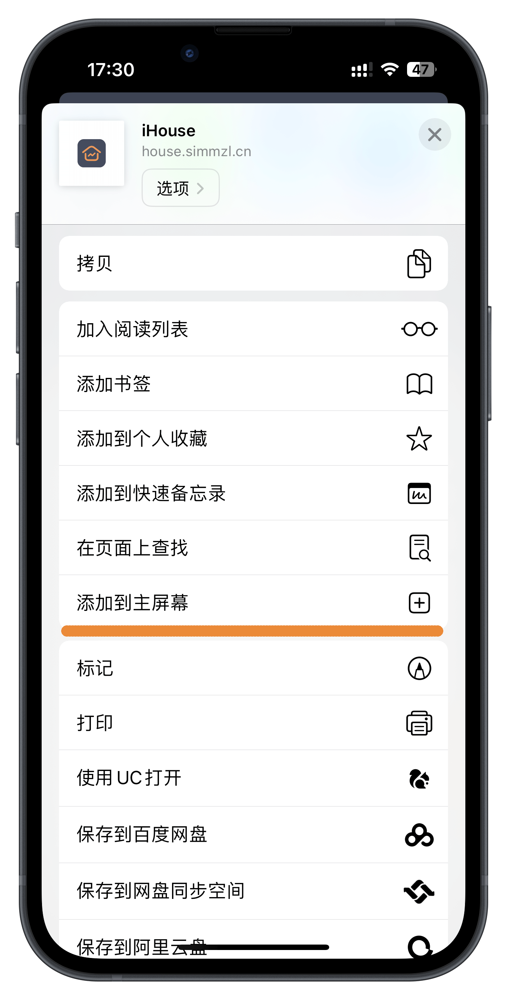
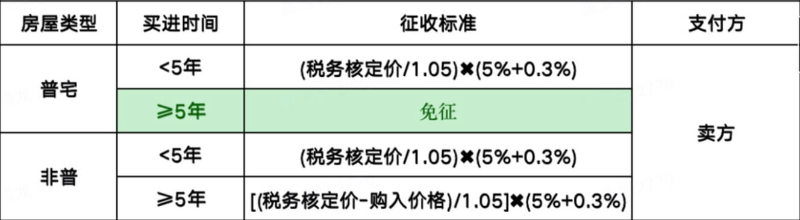
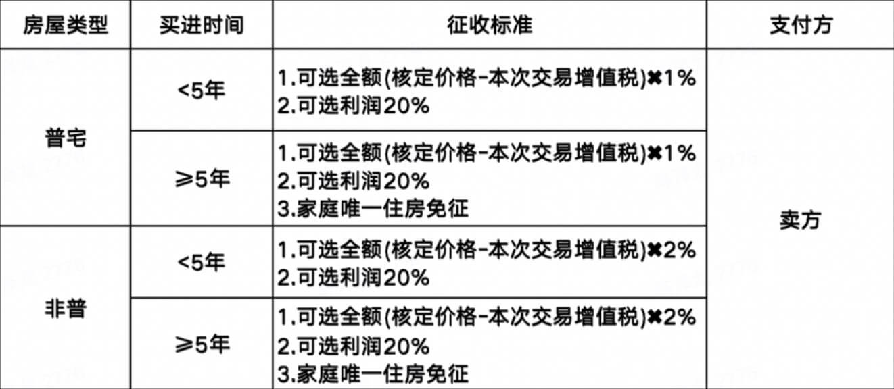
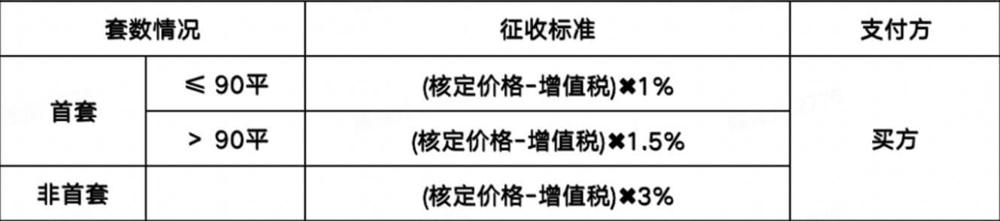

# iHouse - 买房计算器

    

支持新房、二手（基于上海的政策，包括三价就低、动迁规则等）的买房计算器。输入房源信息，即可得到关键的**首付**、**税费**与**贷款**信息。

## 使用 🧮

**如果有帮助，欢迎 Star 🌟**

### Web
链接：[house.simmzl.cn](https://house.simmzl.cn/)
扫码预览：

### PWA
支持[PWA](https://web.dev/progressive-web-apps/)，可通过 `Safari-添加主屏幕`，安装并离线使用。

## 计算规则 📖

基于上海的政策。

### 税费

> 普通住宅标准：
> 1.内环内，面积小于140平方，总价低于450万(含)；
> 2.内、外环之间，面积小于140平方，总价低于310万(含)；
> 3.外环外，面积小于140平方，总价低于230万(含)；

#### 增值税
免征: 一手动迁；

#### 个人所得税
免征: 满五且唯一；
否则，征收标准中动迁房的系数取1%，商品房的系数取2%；

#### 契税

### 贷款

默认基于35%首付，100万公积金贷款计算。

#### 公积金

> [个人住房贷款政策](https://www.shgjj.com/html/newxxgk/ywzn/sydk/dksq/209124.html)

贷款期限：
（1）所购住房房龄≥5年的，公积金贷款期限≤30年；
（2）所购住房房龄6≤N≤19年的，公积金贷款期限≤(35-房龄)；
（3）所购住房房龄≥20，公积金贷款期限≤15年。

## 注意事项

本地历史记录基于`LocalStorage`实现。
由于`iOS`对`PWA`的支持添加了很多限制，如`LocalStorage`会被**清空**，导致历史记录丢失。
因此历史记录功能推荐在Safari等浏览器中使用...😮‍💨

`Safari`的`LocalStorage`策略：
> Now ITP has aligned the remaining script-writable storage forms with the existing client-side cookie restriction, deleting all of a website’s script-writable storage after seven days of Safari use without user interaction on the site. 

`iOS`对`PWA` `LocalStorage`的策略
> As mentioned, the seven-day cap on script-writable storage is gated on “after seven days of Safari use without user interaction on the site.” That is the case in Safari. Web applications added to the home screen are not part of Safari and thus have their own counter of days of use. Their days of use will match actual use of the web application which resets the timer. We do not expect the first-party in such a web application to have its website data deleted.

策略全文：[Full Third-Party Cookie Blocking and More](https://webkit.org/blog/10218/full-third-party-cookie-blocking-and-more/)

